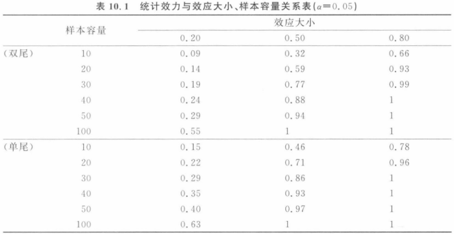

---
tags:
  - 学习/心理学
status: 尚未完成
---
# 独立样本 t 检验与相关样本 t 检验

## 本章概览

在之前的学习中，我们掌握了单样本 t 检验。在本章，我们学习了两样本 t 检验的方法。其中，独立样本 t 检验是在两样本互不相关的基础上进行的，而相关样本t检验的两样本之间存在匹配或前后比较关系。学会区分并应用这两种t检验方法，有助于我们判断两个样本之间是否存在显著差别。注意学习本章时，可以结合之前单样本 t 检验的内容进行对比学习。

## 学习要点

1. 区分独立样本t检验与相关样本t检验
2. 掌握独立样本t检验与相关样本t检验的逻辑
3. 学会计算独立样本与相关样本的t统计量
4. 学习独立样本t检验与相关样本t检验的统计前提
5. 掌握独立样本t检验与相关样本t检验的效应与效力

## 独立样本均值差异的分布

在独立样本设计中，每一个总体都有一个均值分布，这样对两个总体来说，我们就要处理两个不同的均值分布。我们从第一个总体的均值分布中随机选择一个均值，再从第二个总体的均值分布中随机选择一个均值。将抽取的两个均值相减，得到一个均值差异的分数，多次重复这一过程，我们就可以得到一个均值差异的分布。

如果虚无假设是正确的，那么两个总体的均值是相等的，所以我们得到的均值差异的分布的均值是0。这一分布的方差总体取决于估计的总体方差，因此我们可以把它看作一个t分布来进行检验。我们先利用样本方差来估计总体方差，从而估计总体样本分布的方差，然后再结合两个样本均值分布的方差构造一个新的估计值，用于描述样本均值分布的变异。

## 独立样本的 t 统计量

### 独立样本t检验的假设

- 虚无假设（$H_0$：$\mu_1-\mu_2=0$）：独立样本所来自的两个总体的均值之间没有显著的差异，即所抽取的两个样本来自同一个总体。

- 备择假设（$H_1$：$\mu_1-\mu_2\neq0$）：独立样本所来自的两个总体的均值之间有显著差异。

### 总体方差的估计

总体方差的合并估计值为 $S_p^2=\dfrac{SS_1+SS_2}{df_1+df_2}$ 

- 估计的思路：将两样本进行加权平均，权重是样本的自由度
- 估计的前提：两样本方差大体相等（即满足方差同质性）

### 均值分布的方差的计算

- $S_1^2=\dfrac{S_p^2}{n_1}$
- $S_2^2=\dfrac{S_p^2}{n_2}$

- 计算的思路：由于样本容量 $n$ 存在差异，两个样本均值的分布不一定相同，因此均值分布的变异性需要考虑样本容量。

### 标准误的计算

- $S_{\overline{X_1}-\overline{X_2}}^2=S_1^2+S_2^2$
- $S_{\overline{X_1}-\overline{X_2}}=\sqrt{\dfrac{S_p^2}{n_1}+\dfrac{S_p^2}{n_2}}$

- 计算的思路：均值差异样本的方差是总体1与总体2的均值分布的方差之和。

### t 统计量的计算

- $t=\dfrac{(\overline{X_1}-\overline{X_2})-(\mu_1-\mu_2)}{S_{\overline{X_1}-\overline{X_2}}}=\dfrac{(\overline{X_1}-\overline{X_2})}{S_{\overline{X_1}-\overline{X_2}}}$

### 与单样本T检验的不同之处

1. 比较的分布是均值差异的分布（$\overline{X_1}-\overline{X_2}$）
2. 确定 t 的临界值是基于两个样本的自由度（$df_1$ 和 $df_2$）
3. 比较分布的样本分数是基于两个分数之差

## 独立样本t检验的统计前提

1. 观察间彼此独立
2. 两个总体均为正态分布
3. 两个总体具有相等的方差（方差同质性）    

一般情况下，独立样本 t 检验对于违反前提条件的情况有一定的**耐受性**。当使用双尾检验或当样本量不是很小时，t 检验都是很**稳健（robust）**<wbr>的。如果因为某些原因我们觉得总体可能不是正态分布，那么应该尽量选用相对较大的样本。

- **方差同质性（homogeneity of variance）**，也称方差齐性，即要比较两个总体是否具有相同的方差。t 统计量公式中的联合方差是对两个样本方差进行平均以后得到的，而这样的操作只有当这两个值用来估计同一总体的方差时才有意义。

- **Hartley最大F值检验（Hartley's Fmax test）**,检验方差是否同质的方法。Fmax为两方差的比值，把较大的样本方差置于分子，较小的置于分母，这样Fmax的值总是大于1的。

- **拇指原则**：对于小样本(n＜10) ，如果一个方差是另一个的四倍以上，则不满足方差齐性；对于大样本，标准为2倍。
## 独立样本t检验的效应量、置信区间和效力
### 独立样本 t 检验的效应量

效应量 (effect size, ES) 的大小代表两个总体分布的重叠程度。在独立样本 t 检验中，效应大小的计算公式如下：
$$ ES=\dfrac{\overline{X_1}-\overline{X_2}}{S_p}$$

其中 $\overline{X_1}$ 和 $\overline{X_2}$ 分别代表两个独立样本的均值，而 $S_p$ 代表的是对总体标准差的估计值。ES越小，代表重叠程度越大，效应越小；ES越大，重叠程度越小，效应越大。

### 独立样本 t 检验的置信区间

独立样本 t 检验的置信水平为 $1-\alpha$ 的置信区间为：
$$
\left[\overline{X}-\overline{Y}\pm t_{\alpha/2}(n_1+n_2-2)S_w\sqrt{\dfrac{1}{n_1}+\dfrac{1}{n_2}}\right]
$$

其中 $S_w$ 是对总体标准差的估计值。

### 独立样本 t 检验的效力

效力的大小和显著性水平、样本容量和检验方向有关。

- 样本量越大，效力越高；
- 效应越大，效力越高；
- 相同条件下单尾检验的效力比双尾检验效力高。、

## 相关样本 t 检验统计量
### 相关样本的意义

- 被试内设计，两组数据不存在组间差异。
- 匹配组t-test是有一个或若干个特征使得被试内两两建立联系，这种联系时实验前建立的，分析数据时已匹配成对。
- 匹配能大大减少个体间的误差，提高统计效力。

### 相关样本 t 检验的逻辑

- 相关样本 t 统计量的计算基于样本分数的差异，每一对对应数据的差异 D 构成了一个差异样本
- 平均数$D=X_1-X_2$
- 方差$S^2=\dfrac{SS_D}{df}=\dfrac{\sum D^2-\dfrac{(\sum D)^2}{n}}{df}$

### 相关样本 t 的计算

- $S_{\overline{D}}=\sqrt{\dfrac{S^2}{n}}$
- $t=\dfrac{\overline{D}-\mu_D}{S_{\overline{D}}}$

### 相关样本 t 检验的效应大小

- 效应大小=差异样本均值/差异样本方差

## 相关样本t检验的效应量、置信区间和效力

### 相关样本t检验的效应量

- **效应量**（effect size）：表示两个分布的重叠程度，它反映研究中处理效应的大小。效应量不受样本量影响。
- 相关样本 t 检验的效应量＝差异样本均值/差异样本方差，即
$$\text{Cohen's}\ d = ES =\dfrac{\overline{D}}{S_D}$$

### 相关样本 t 检验的置信区间

两个相关样本差异的95%置信区间为：
$$\left(\overline{D}-t_{(\alpha/2,df)}S_{\overline{D}}, \overline{D}+t_{(\alpha/2,df)}S_{\overline{D}}\right)$$

### 相关样本t检验的效力

研究结果的统计效力、效应大小、样本容量以及显著性水平相互联系。当显著性水平为0.05时，统计效力与效力大小、样本容量的关系如表所示。

## 相关样本 t 检验的统计前提

- 在每一种处理条件内，观察都彼此独立
- 差异分数的总体分布是正态的
- 不需要考虑方差同质性