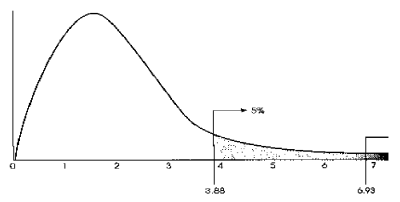

---
tags:
  - 学习/心理学
status: 尚未完成
---
# 单因素方差分析

## 本章概览

t-检验和 z-检验不能用于多于2组的数据. 处理这类数据需要用 一种新的推论统计程序: 方差分析（ANOVA）。在方差分析中，我们利用F统计量来比较多组数据之间是否有显著差异。在统计显著性的基础上，我们又会应用两种事后检验方法比较两两之间的差异性，并对 ANOVA 的效应进行评估。  

## 学习要点

1. 区分单因素设计与因素设计  
2. 掌握ANOVA的逻辑  
3. 理解方差的可分解性  
4. 学会计算F统计值  
5. 掌握利用简便公式进行ANOVA的方法  
6. 学会进行事后检验  
7. 学会计算ANOVA的效应  

## 单因素设计

在方差分析中，因素就是自变量。因此，只有一个自变量的研究被称为**单因素设计**。具有多个自变量的研究被称为**多因素设计**。构成因素的个别处理条件被称为因素的水平。
## 方差的分解

### 方差的可分解性

- 指总的离差平方和可以分解为几个不同来源的平方和。

### 总方差的组成

- 组间平方和（分子）：处理间方差
- 组内平方和（分母）：不是由于处理引起的方差
$$
\sum(X_{i}-\overline{X})^2=\sum(X_{i}-\overline{X_{b}})^2+\sum(\overline{X_{b}}-\overline{X})^2
$$

可简化为：
$$
SS_{T}=SS_{W}+SS_{B}
$$

- 公式的理解：总平方和=组内平方和+组间平方和
## F统计值 

- F=处理间均方/处理内均方

- F分布

- 当F统计量的观测值小于临界值时，说明数据的总变异中，大部分是由实验误差和个体差异所致，不能认为实验处理有效；
- 当F统计量的观测值大于临界值时，说明实验数据的变异的确由不同的实验处理所造成，即不同处理之间存在差异。
- 使用F统计量的前提：1.总体正态；2.变异的同质性；3.独立性。

## ANOVA的步骤 

1. 陈述原假设 $H_{0}$ 和备择假设 $H_1$，确定进行检验的显著性水平 $\alpha$
2. 确定检验的方向性，需要注意的是 ANOVA 检验总是**单尾检验**
3. 指出检验的自由度 $df$，注意在 ANOVA 检验中有两个自由度，分别是组间变异的自由度 $(k-1)$ 和组内变异的自由度 $(N-k)$，其中 $k$ 为设置水平数，$N$ 为总的样本容量
4. 根据组间自由度、组内自由度以及显著性水平 $\alpha$，查表找出临界 $F$ 统计量的值
5. 对于样本计算 $F$ 统计量的值，画出如下图所示的方差分析表  
6. 比较计算得出的 $F$ 值和临界 $F$ 值，如果 $F<F_{crit}$，则接受原假设 $H_0$，如果 $F>F_{crit}$，则拒绝 $H_0$，接受备择假设 $H_1$
7. 进行事后检验。

## 事后检验

1. ANOVA无法说明哪个备择假设得到支持；
2. 要进行事后检验以说明各组差异在什么地方；
3. 事后检验是比较每一个组和另一个处理组，一次比较两个，这称为成对比较。
### 族系误差

1. 每一个比较都是一个单独的假设检验，每一个都有犯I类错误的风险。所以，比较对数越多，作结论的风险越大。即容易发现实际不存在的差异。这称为实验导致的 $\alpha$ 水平或族系误差；
2. 多次比较后犯 I 类错误的概率为 $\alpha_{EW}=1-(1-\alpha)^c$，其中c为比较的次数
  
### Tukey's HSD 检验

1. 此检验各组要有相同的样本容量;
2. 可以计算出单一的值确定处理均值间的最小差异，考查此差异在统计上是否显著;
3. $HSD=q\sqrt{\dfrac{MS_{\text{组内}}}{n}}$
4. q可以查表得到。

### Scheffe检验 (Scheffe test)

1. 适用于n不相等的情况;
2. 降低I类错误的风险，提高II类错误的风险。

### ANOVA的效应

1. 效应大小与统计工具的敏感性无关，它表示几个总体平均值之间的距离，也不依赖样本容量这类测量特性。  

2. 效应量：$\eta^2=\dfrac{SS_{\text{组间}}}{SS_{\text{组间}}+SS_{组内}}$

3. ANOVA 中 r 与效应量关系：$\eta^2=r^2$
4. ANOVA中效应的评估：

| $r^2$ 的大小       | 效应的评估 |
| --------------- | ----- |
| $0.01<r^2<0.09$ | 小的效应  |
| $0.09<r^2<0.25$ | 中等效应  |
| $r^2>0.25$      | 大的效应  |
